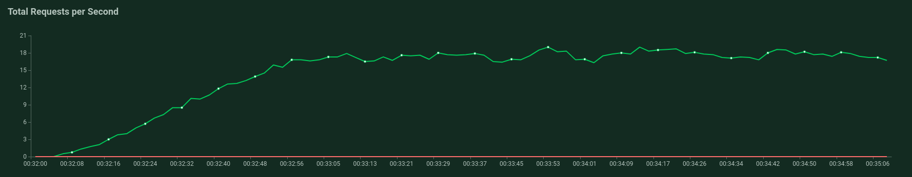

# Load Testing Findings

### Input:
- 50 Users
- Hatch Rate of 1 User/sec
- min-wait: 500ms
- max-wait: 5000ms

## /Index

_1608874320.png)

#### Findings
- Inital Spike to 400ms at 6-8secs
- Maintained 1 Instance/did not auto scale to more
- Overall, one instance handed 16.8requests/sec well with average response times of 150ms

## /Menu

_1608875264.png)

#### Findings
- scaled to 3 instances
- spike to 8000secs while additional instances were waiting to turn on at 0:48:38
- Maintained 560 ms Median Response Rate, 650ms 95th percentile

# Suggestions
- Reduce ColdStart Times on additional instances by reducing # of useless dependencies and stop commiting useless files like pycache as it makes the underlying app engine image larger, thus harder to start
- **Try Commenting out libraries in requirements.txt to see which one of useless**